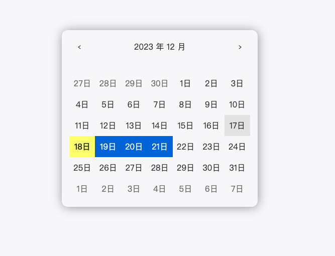

# 國泰世華作業

## FE (Not Angular)
檔案位於 `FE (Not Angular)` 底下的 `index.ts`，使用 typescript 的寫法。

## FE-react
### 截圖畫面

### 如何啟動？
> 請透過 HTML server 去伺服此 HTML 檔案，以下兩種方法。
1. 透過 http-server
    - Have Node.js installed in your system.
    - In CMD, run the command `npm install http-server -g`
    - Navigate to the specific path of your file folder in CMD and run the command http-server
    - Go to your browser and type [http://localhost:8080](http://localhost:8080). Your Application should run.

2. 透過 VSCode 的 Live Server
    - 下載安裝 [Live Server](https://tinyurl.com/y5p8qc4h)
    - 參考說明點擊 VSCode 右下角 Go Live 即可
